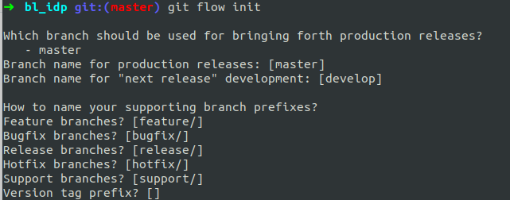

Git Flow Example:

Why should follow git flow

GitFlow is a collection of Git commands to provide many repository operations with just single command.
 It helps to keep track of features, hotfixes and releases in projects. 
 
 Advantages of Git Flow
 Gitflow was developed to manage the branching mechanism with a standardised approach when developing features, handling releases and managing hotfixes.
 Using multiple separate branches in Git will provide flexibility but gets complex. This is easy in gitflow.
 Gitflow makes developer speed up the process with familiar branch structure.
 Single command to do multiple things at a time.
 Switching branches is easy.
 Keep repository & process clean and tidy.
 
 Installation:
 
 Setup
 You need a working git installation as prerequisite.
 Git flow works on macOS, Linux and Windows
 
 macOS
 Homebrew
 $ brew install git-flow-avh
 Macports
 $ port install git-flow-avh
 
 Linux
 $ apt-get install git-flow
 Windows (Cygwin)
 $ wget -q -O - --no-check-certificate https://raw.github.com/petervanderdoes/gitflow-avh/develop/contrib/gitflow-installer.sh install stable | bash
 
 
 Getting started
 Git flow needs to be initialized in order to customize your project setup.
 
 Initialize
 Start using git-flow by initializing it inside an existing git repository:
 
 git flow init
 After installing git-flow you can use it in your project by executing git flow init. Git-flow is a wrapper around Git. 
 The git flow init command is an extension 
 of the default git init command and doesn't change anything in your repository other than creating branches for you.
 You'll have to answer a few questions regarding the naming conventions for your branches.
 It's recommended to use the default values.
 
 
 
 
 How it works
 
 Instead of a single master branch, this workflow uses two branches to record the history of the project. The master branch stores the official release history, and the develop branch serves as an integration 
 branch for features. It's also convenient to tag all commits in the master branch with a version number.
 
 When using the git-flow extension library, executing git flow init on an existing repo will create the develop branch:

Feature Branches
Each new feature should reside in its own branch, which can be pushed to the central repository for backup/collaboration. But, instead of branching off of master, feature branches use develop as their parent branch. When a feature is complete,
 it gets merged back into develop. Features should never interact directly with master.
 
 
 Creating a feature branch
 Without the git-flow extensions:
 
 git checkout develop
 git checkout -b feature_branch
 
 When using the git-flow extension:
 
 git flow feature start feature_branch
 
 Continue your work and use Git like you normally would.
 
 Finishing a feature branch
 When you’re done with the development work on the feature, the next step is to merge the feature_branch into develop.
 
 Without the git-flow extensions:
 
 git checkout develop
 git merge feature_branch
 
 Using the git-flow extensions:
 
 git flow feature finish feature_branch
 
 
 Release Branches

 Once develop has acquired enough features for a release (or a predetermined release date is approaching), you fork a release branch off of develop. Creating this branch starts the next release cycle, so no new features can be added after this point—only bug fixes, documentation generation, and other release-oriented tasks should go in this branch. Once it's ready to ship, the release branch gets merged into master and tagged with a version number. 
 In addition, it should be merged back into develop, which may have progressed since the release was initiated.
 
 Without the git-flow extensions:
 
 git checkout develop
 git checkout -b release/0.1.0
 When using the git-flow extensions:
 
 $ git flow release start 0.1.0
 Switched to a new branch 'release/0.1.0'
 
 Once the release is ready to ship, it will get merged it into master and develop, then the release branch will be deleted. It’s important to merge back into develop because critical updates may have been added to the release branch and they need to be accessible to new features. If your organization stresses code review, this would be an ideal place for a pull request.
 
 To finish a release branch, use the following methods:
 
 Without the git-flow extensions:
 
 git checkout master
 git merge release/0.1.0
 Or with the git-flow extension:
 
 git flow release finish '0.1.0'
 
 
 Hotfix Branches
 
 Maintenance or “hotfix” branches are used to quickly patch production releases. Hotfix branches are a lot like release branches and feature branches except they're based on master instead of develop. This is the only branch that should fork directly off of master. As soon as the fix is complete, it should be merged into both master and
  develop (or the current release branch), and master should be tagged with an updated version number.
  
  Without the git-flow extensions:
  
  git checkout master
  git checkout -b hotfix_branch
  When using the git-flow extensions: 
  
  $ git flow hotfix start hotfix_branch
  
  Similar to finishing a release branch, a hotfix branch gets merged into both master and develop.
  
  git checkout master
  git merge hotfix_branch
  git checkout develop
  git merge hotfix_branch
  git branch -D hotfix_branch
  $ git flow hotfix finish hotfix_branch
  
  
  The overall flow of Gitflow is:
  
  A develop branch is created from master
  A release branch is created from develop
  Feature branches are created from develop
  When a feature is complete it is merged into the develop branch
  When the release branch is done it is merged into develop and master
  If an issue in master is detected a hotfix branch is created from master
  Once the hotfix is complete it is merged to both develop and master